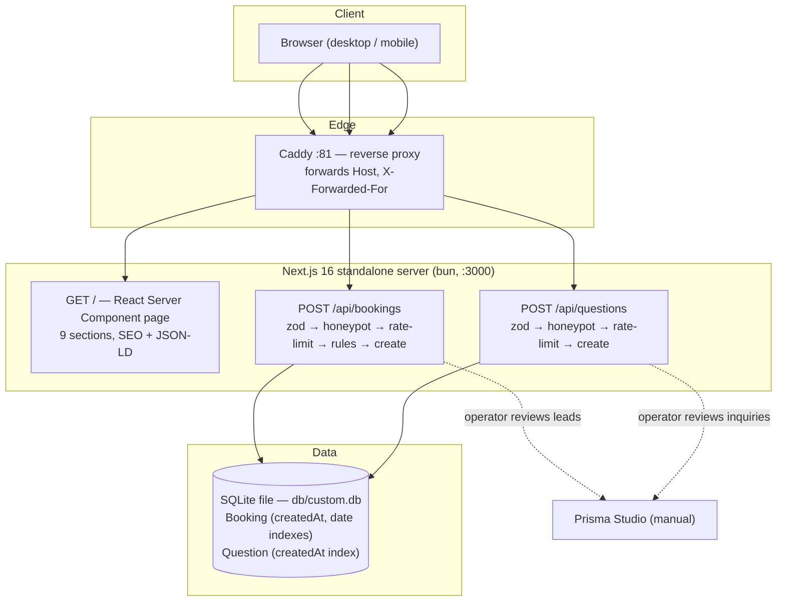
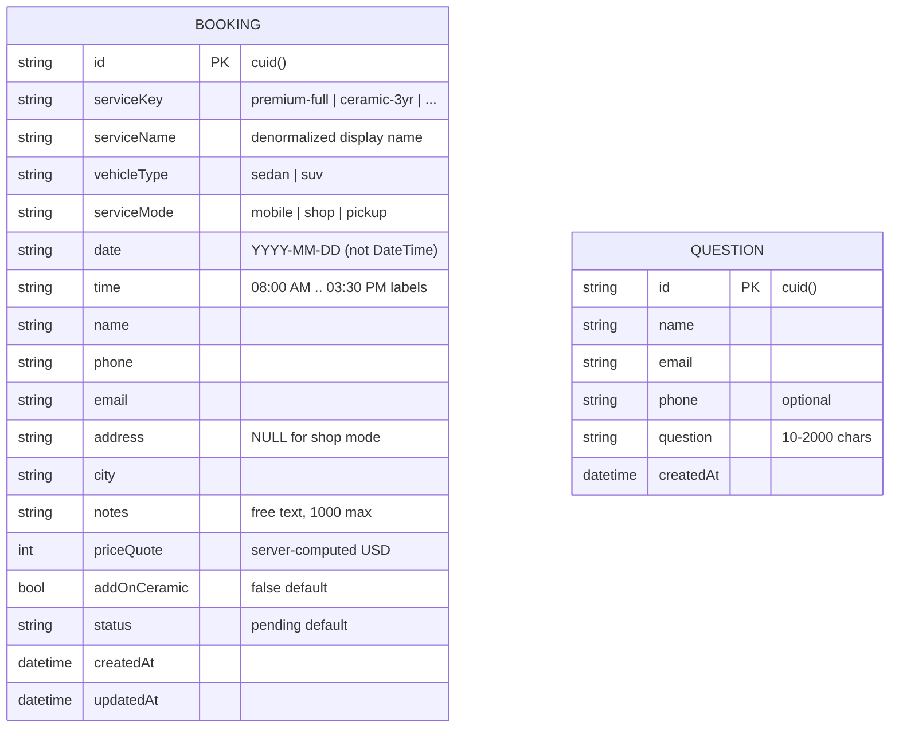

# We Care Car Care (car-care) — Master Project Architecture Document (PAD) v1.2.0

**Classification:** Internal Engineering Reference
**Status:** DEFINITIVE, PRODUCTION-LOCKED BLUEPRINT
**Companion Documents:** `README.md` (public-facing), `CLAUDE.md` (agent instructions), `AGENTS.md` (compact onboarding), `car-care_SKILL.md` (distilled engineering skill — patterns, anti-patterns, debugging, pre-ship checklist), `docs/prompt-to-create.md` (origin brief)
**Last Updated:** 2026-09-13
**Audience:** Senior Engineers, Tech Leads, DevOps, and Onboarding Engineers
**Rule:** Every architectural decision in this document traces to a specific rationale. Nothing is here "because it's popular."

---

#### Revision Block — v1.3.0 (Tracked Changes)

- `[MA]` v1.3.0 — remediation cycles 3+4 refresh (see `docs/code-review-audit-2026-09.md` + cycle 4): shared contract-tested `db-url.ts` resolver + `scripts/db.ts` CLI wrapper (env-drift-proof DB path); security headers (CSP/HSTS/XFO/nosniff/Referrer/Permissions-Policy, `poweredByHeader: false`) in `next.config.ts`; 413 payload guard (32KB) wired into both routes; `cf-connecting-ip`-aware `clientIpFrom`; sanitized API error logs; hydration-safe footer year; one init migration (`prisma/migrations/20260913142416_init/`) from the live-server bootstrap (db:push remains primary — ADR-002 updated); unit suite grew to 66 tests / 8 files (adds `db-url`, `client-ip`, `payload-limit`); e2e grew to 31 tests / 5 specs (adds 413 contracts); `bun.lock` workspace identity fixed (`car-care`); git invariants restored (`.env` + `db/custom.db` untracked, guarded by `scripts/skill-verify.sh` check 9); Pattern-1 sample below now shows the real route code (TZ-safe `isSunday`, `clientIpFrom`, 413 guard). Gates: 66 unit × 3 TZ + 31 e2e green.
- `[MA]` v1.2.0 — audit cycle 2 (see `docs/audit-e2e-2026-09.md`): `.env.example` added (`.gitignore` negation `!.env.example`); Playwright e2e suite adopted from `nordeim/home-financing` (29 tests, standalone webServer on :3100, `e2e/` typechecked by tsconfig — ADR-010); `public/robots.txt` gained its missing `Sitemap:` directive; a11y remediation (lighthouse 0.97 → 1.0): `role="img"` star spans, content-composed logo name (Label-in-Name), aria-label dropped from the CTA rating `<p>`; hero image made responsive (640w/1024w srcset — phones download 44 KB vs 161 KB); dead `/api` hello-world route deleted. Gates: 49 unit × 3 TZ + 29 e2e green; lighthouse a11y/bp/seo 1.0, perf 0.80.
- `[MA]` v1.1.2 — supply-chain hardening: `prisma` CLI moved to `devDependencies` (never runtime-imported — only `@prisma/client` via `src/lib/db.ts`); `overrides` added to `package.json` pinning `defu@6.1.7`, `deepmerge-ts@8.0.2`, `baseline-browser-mapping@2.11.23`; `bun audit --prod` now reports zero findings (full-audit remainder is dev-tooling chains only — 24 findings, 0 critical); pre-deploy checklist + known-issues table updated; `car-care_SKILL.md` refreshed to v1.1.0 (project state, S1–S3 follow-up, audit history). All gates re-verified: 49/49 tests × 3 timezones, lint + tsc clean, build green, E2E booking + toast re-confirmed.
- `[MA]` v1.1.1 — dependency-version realignment (React 19.3.0, Tailwind 4.3.3, Zod 4.6.4, Vitest 5.0.0, Prisma 6.19.3, ESLint 9.39.5 — corrected against `bun.lock` after the v1.1.0 upgrades left stale numbers); ADR-001 decision text updated to reflect that all `wcc/` components became `"use client"` islands in v1.1.0; added `car-care_SKILL.md` (v1.0.0, 1,017 lines) as a companion document — distilled via the six-phase `to-distill-project-into-skill` process with all facts verified against the working tree.
- `[MA]` v1.1.0 — post-audit remediation: Next 16.3.5 security upgrade, 44 unused dependencies + 39 unused ui primitives pruned, tsconfig scoping + build type enforcement, `db/custom.db` untracked, Vitest suite (49 tests) introduced, timezone-safe date rules, shared rate-limit/schemas modules, toast wiring fix (sonner), two-tone amber+teal accent system, dual sedan/SUV pricing in cards, package card imagery, FAQ card styling, final-CTA imagery, mobile call FAB, app icon + sitemap. Full audit trail in `docs/audit-and-remediation-2026-09.md`.
- `[CA]` Known-issues table includes honest gaps rather than aspirational claims.
- `[SYN]` v1.0.0 — initial PAD generated from full codebase analysis (15 site components, 3 API routes, Prisma schema, styling system, build scripts).
- `[SR]` All dependency versions pinned from `bun.lock`; all commands verified against `package.json` scripts.

### Table of Contents

1. [System Overview & Decisions](#1-system-overview--decisions)
2. [High-Level System Topology](#2-high-level-system-topology)
3. [Application Architecture](#3-application-architecture)
4. [Data Architecture](#4-data-architecture)
5. [Design System Reference](#5-design-system-reference)
6. [Security Architecture](#6-security-architecture)
8. [Testing Strategy](#8-testing-strategy)
9. [Build & Deployment](#9-build--deployment)
10. [Developer Handbook](#10-developer-handbook)
11. [Known Issues & Outstanding Tasks](#11-known-issues--outstanding-tasks)
12. [Key Files Reference](#12-key-files-reference)
13. [Glossary](#13-glossary)

---

## 1. System Overview & Decisions

### 1.1 Document Metadata & Purpose

This is the single source of truth for how the car-care codebase is built, why it is built that way, and how to work in it safely. It targets three readers: a **new engineer** onboarding to extend the site, a **debugger** tracing a booking failure from browser to SQLite row, and a **reviewer** evaluating whether a technical choice should change. The site itself is a single-page marketing and booking funnel for a real detailing studio — content is fixed, the conversion goal is a phone call or a persisted booking request. There is no admin surface and no authenticated user; the owner actions leads out of the database directly. Everything downstream of that product shape (no auth stack, no CMS, SQLite over Postgres) follows from it.

### 1.2 Technology Stack Summary

| Layer | Technology | Version | Key Rationale |
|-------|-----------|---------|---------------|
| Web framework | Next.js (App Router) | 16.3.5 | Single route + route handlers in one deployable; RSC keeps the page light with client islands only where interactive; upgraded from 16.1.3 for security advisories (ADR-008) |
| UI runtime | React | 19.3.0 | Required by Next 16; ref-prop components, no forwardRef boilerplate |
| Language | TypeScript | 5.9.3 | Content-as-data pattern (§3.3) only holds with strict typing |
| Styling | Tailwind CSS | 4.3.3 | CSS-first tokens colocate the brand system with its utilities |
| UI primitives | shadcn/ui (Radix) | 9 components vendored | Only the load-bearing set survives the dependency prune: accordion, button, carousel, dialog, input, label, sheet, sonner, textarea (ADR-008) |
| State | Zustand | 5.0.x | 36-line dialog store beats Context boilerplate (ADR-004) |
| Validation | Zod | 4.6.4 | One schema per endpoint in `src/lib/wcc/schemas.ts`; server is the authority |
| Tests | Vitest + Playwright | vitest 5.0.0 / @playwright/test 1.63.0 | 66 unit tests / 8 files (ADR-009) + 31 e2e tests / 5 specs on the standalone build (ADR-010) |
| ORM | Prisma | 6.19.3 | Typed models + `db:push` workflow fits single-file SQLite |
| Database | SQLite | (file: `db/custom.db`, gitignored) | Zero-ops persistence for a single-operator local business |
| Carousel | embla-carousel-react | 8.6.0 | Lightweight testimonial carousel |
| Toasts | sonner | 2.0.8 | Submit feedback in dialogs (`<Toaster />` mounted in layout) |
| Package manager / runtime | bun | 1.3.x | Install + dev + prod server in one toolchain |
| Lint | ESLint (flat config) | 9.39.5 | `next/core-web-vitals` + `next/typescript` presets |
| Proxy | Caddy | `:81` (sandbox) | Reverse proxy to Next standalone server on `:3000` |

### 1.3 Architecture Decision Records (ADRs)

**ADR-001: Single-page Next.js 16 App Router site with client-island dialogs**

- **Context:** The product is a local-service marketing funnel: one story, one conversion path (book or call). Content changes monthly at most. The build must remain fast to iterate and cheap to host.
- **Decision:** One route (`src/app/page.tsx`) composing nine sections plus header/footer chrome; after the v1.1.0 visual remediation every `src/components/wcc/` component is a `"use client"` island (scroll reveals, dialog store, carousel), while `layout.tsx`/`page.tsx`/`sitemap.ts` and the API routes stay server-side. All form submission goes through JSON route handlers (`src/app/api/*/route.ts`).
- **Rationale:** A single RSC page ships minimal client JS; interactive complexity is isolated to two dialogs instead of spread across routes. Multi-page routing would add navigation overhead with zero SEO benefit for a one-location business already covered by JSON-LD.
- **Consequences:** Positive — tiny client bundle, trivial mental model, one page to test E2E. Negative — the page grows long (mitigated by section components); deep links only exist as `#anchors`.
- **Alternatives Rejected:** Separate `/booking` page (breaks the single CTA flow); a site builder / hosted CMS (not a code asset, no custom booking rules); SPA + separate API (two deployables for no gain).

**ADR-002: SQLite via Prisma with `db:push` as the primary workflow**

- **Context:** Lead volume is dozens per week, single writer, single operator, no DB ops staff. (One init migration exists from the 2026-09-13 live-server bootstrap — `prisma/migrations/20260913142416_init/` — and matches the schema; day-to-day schema sync stays `db:push`.)
- **Decision:** Prisma 6 with `provider = "sqlite"`, database at `db/custom.db`, schema applied with `bun run db:push` (`--accept-data-loss` in the script). Two models: `Booking`, `Question`.
- **Rationale:** SQLite is a file — backup is `cp`, inspection is `prisma studio`, hosting needs no database service. For a schema this small (2 tables, 3 indexes) and a team of one, migration history is ceremony without payoff.
- **Consequences:** Positive — zero infra, atomic reads, perfect dev/prod parity. Negative — no concurrent multi-process writes (irrelevant at this scale); `db:push` can drop columns on schema change (acceptable — schema is stable and the DB holds transient leads).
- **Alternatives Rejected:** PostgreSQL (needs a service; wasted on this write volume); file-based JSON store (no query/index tooling); Drizzle (fine, but Prisma Studio + typed client fit the non-DBA operator better).

**ADR-003: Content as a typed data module (`content.ts`) instead of a CMS**

- **Context:** Every price, service feature, FAQ, service area, and business fact appears in multiple places: marketing sections, booking dialog, API validation, JSON-LD.
- **Decision:** `src/data/wcc/content.ts` exports typed constants (`PACKAGES`, `CERAMIC_TIERS`, `INTERIOR_ONLY`, `BOOKABLE_SERVICES`, `BUSINESS`, `FAQS`, …). Components render from it; the API validates `serviceKey` against `BOOKABLE_SERVICES` and prices quotes with the same `quoteFor()` the client uses for its live quote.
- **Rationale:** One edit site for all business facts eliminates the classic drift bug where the page says $295 and the API charges $240. TypeScript enforces the contract at compile time — a typo'd key is a type error, not a runtime surprise.
- **Consequences:** Positive — single source of truth, typed, diffable in git. Negative — content edits are code edits (fine for this team; would not scale to non-technical editors).
- **Alternatives Rejected:** CMS/headless (operational weight, no editors); per-component constants (drift); config file + runtime validation (weaker typing).

**ADR-004: Zustand for dialog orchestration over React Context or URL state**

- **Context:** Eleven CTAs across the page must open the booking dialog, several with a preselected service; the question dialog can open from hero and footer.
- **Decision:** A compact Zustand store (`src/lib/wcc/booking-store.ts`, ~38 lines) holds `bookingOpen`, `presetService`, `presetAddOnCeramic`, `questionOpen` plus open/close actions; any component subscribes with a selector.
- **Rationale:** No provider to mount, no re-render cascade (selector-based subscriptions), preset service flows through `openBooking(serviceKey?)` naturally. Context would require a provider wrapper and re-render every consumer on every open/close.
- **Consequences:** Positive — minimal API, works outside the React tree if needed. Negative — one more dependency; state is not visible in the URL (back button does not close the dialog — acceptable for this UX).
- **Alternatives Rejected:** React Context (provider + render cost for a global boolean); URL query state (pollutes anchors); lifting state to `page.tsx` (prop drilling).

**ADR-005: Bot defense without authentication — honeypot + in-memory sliding window**

- **Context:** Two public POST endpoints with no accounts. Real users must never see a captcha; abuse must not flood the owner's lead inbox.
- **Decision:** Each endpoint: (1) Zod validation, (2) hidden `company` honeypot field — non-empty returns a **fake `201`** and writes nothing, (3) per-IP sliding-window rate limit (5 requests / 10 minutes, in-memory `Map`), (4) business-rule checks, (5) persist.
- **Rationale:** Honeypot fake-success denies bots feedback; rate limiting caps blast radius from a single IP; Zod kills malformed payloads before they reach Prisma. No captcha preserves conversion.
- **Consequences:** Positive — zero friction, zero external services, cheap. Negative — limit resets on process restart and is per-instance (fine for one container); a distributed bot farm is out of scope for a local detailing shop.
- **Alternatives Rejected:** reCAPTCHA/hCaptcha (friction + third-party script + privacy); Turnstile (external dependency); DB-backed rate limiter (over-engineering); auth tokens (no user accounts exist).

**ADR-006: Standalone output served by bun behind Caddy**

- **Context:** The sandbox/host runs a Caddy edge on `:81` proxying to the app; the app must start fast with minimal node_modules surface.
- **Decision:** `next.config.ts` sets `output: "standalone"`; the `build` script copies `.next/static` and `public` into `.next/standalone/`; `start` runs `bun .next/standalone/server.js` with `NODE_ENV=production`.
- **Rationale:** Standalone output shrinks the deployable to a server.js + traced node_modules subset. Bun starts it faster than node with zero config. Caddy terminates the edge and forwards `X-Forwarded-For` (which the rate limiter keys on).
- **Consequences:** Positive — small artifact, one-command prod, no Docker needed. Negative — the static/public copy step is manual and easy to forget (documented as a troubleshooting item); dev (`next dev`) and prod (standalone) have slightly different module resolution.
- **Alternatives Rejected:** `next start` (needs full node_modules); Docker (no orchestrator here); Vercel (fine, but self-hosted bun is cheaper and matches the sandbox).

**ADR-007: Dark-first hardcoded theme, brand tokens in CSS `:root`, two-tone accent system**

- **Context:** The brand is automotive-detailing dark (charcoal + amber + teal). A light mode was never requested and would double the QA surface. The source site uses a two-tone accent (amber CTAs + teal keyword highlights) that the first build flattened to amber-only.
- **Decision:** `<html className="dark" suppressHydrationWarning>` is hardcoded in `layout.tsx`; all colors are HSL/hex custom properties in `:root` (`globals.css`) mapped through Tailwind 4's `@theme inline`. Amber `--primary` `#f2a61c` for CTAs and key numbers; teal `--accent-teal` `#5eead4` (≈13:1 on background) for keyword highlights in section headlines via `text-accent-teal`. The legacy `tailwind.config.ts` and `next-themes` dependency were **removed** in v1.1.0.
- **Rationale:** One theme, tested once. Tokens in CSS (not a JS config) keep Tailwind 4's CSS-first model authoritative. The teal accent restores the source site's two-tone visual rhythm without a second interactive color.
- **Consequences:** Positive — zero flash-of-wrong-theme, one contrast surface to audit, richer headline hierarchy. Negative — adding light mode later requires tokenizing every custom hex.
- **Alternatives Rejected:** next-themes toggle (unwanted UX surface; the site is dark-only so the sonner Toaster pins `theme="dark"` directly); styled-components/other-in-JS (Tailwind already present).

**ADR-008: Dependency and dead-code pruning (v1.1.0 security remediation)**

- **Context:** `bun audit` reported 90 vulnerabilities (3 critical, 48 high). The critical items (`next-auth` homoglyph bypass; `next@16.1.3` middleware bypass / Server Components DoS / AVIF RCE) were all reachable because template scaffolding shipped unused dependencies. 44 dependencies and 39 vendored ui primitives had zero imports from site code.
- **Decision:** Upgrade `next` to 16.3.5 (≥16.2.5 fixes all listed advisories); remove `next-auth`, `@dnd-kit/*`, `@mdxeditor/editor`, `framer-motion`, `recharts`, `uuid`, `next-themes`, 32 unused `@radix-ui/react-*` packages and the rest; delete every `src/components/ui/` file except the nine in use; delete `tailwind.config.ts`, `hooks/use-toast.ts`, `hooks/use-mobile.ts`. Fix the discovered toast-wiring bug by mounting the sonner `<Toaster />` in `layout.tsx` (booking-dialog already called sonner `toast.success`, but only the radix toaster was mounted — the success toast never rendered).
- **Rationale:** Unused code cannot break; unused dependencies still get CVEs. Pruning cut the audit to 27 findings, all in dev-tooling chains (eslint/babel/prisma CLI) that never enter the standalone runtime bundle.
- **Consequences:** Positive — 0 critical/0 runtime vulns, smaller install, `bun install` faster, one toast system. Negative — re-adding a pruned primitive now means restoring its dependency too (documented in AGENTS.md).
- **Alternatives Rejected:** Upgrading `next-auth` in place (zero imports — the fix is deletion); keeping unused ui files "for later" (they were the audit surface).

**ADR-009: Vitest unit suite with timezone-verified date rules (TDD baseline)**

- **Context:** The v1.0.0 audit found zero tests and a timezone bug: the Sunday-closure and 60-day-window rules parsed the ISO date in **host-local** time, so a UTC-hosted server would shift the closed-day boundary by hours away from the business's `America/New_York` calendar.
- **Decision:** Add Vitest (node env, `@/` alias). Suites cover `quoteFor`/`buildDayOptions`/`usd`, the extracted zod schemas (`src/lib/wcc/schemas.ts`), the shared `SlidingWindowRateLimiter` (`src/lib/wcc/rate-limit.ts`), and the zustand store. Date logic moved to `src/lib/wcc/dates.ts`: weekday derived from the ISO string via UTC-midnight parsing, "today" derived from `America/New_York` via `Intl.DateTimeFormat` — both host-timezone independent. The suite is verified green under `TZ=UTC`, `TZ=America/New_York`, and `TZ=Asia/Singapore`.
- **Rationale:** The API is the authority on business rules; those rules deserve executable specifications. The three-timezone run is the regression proof for the fix.
- **Consequences:** Positive — 49 tests gate every commit (`npm test`); route handlers shrank to pipeline-only code importing shared modules. Negative — none remaining; the "no E2E" gap was closed in v1.2.0 (ADR-010).
- **Alternatives Rejected:** Jest (slower, more config); testing routes end-to-end only (slower feedback, needs a DB fixture per run); fixing the timezone bug without a test (exactly how it regresses).

**ADR-010: Playwright e2e suite against the standalone build (v1.2.0)**

- **Context:** Cycle-1 left the dialog flow and API surface manually verified only; the repo had no executable UI contract. The reference repo (`nordeim/home-financing`) had already distilled a working pattern: production webServer, request-fixture API tests with unique `x-forwarded-for`, and axe-core a11y gates.
- **Decision:** Adopt Playwright (chromium, serial workers, port 3100). The `webServer` runs the standalone artifact via `bun run start` — never `next dev`, which Next refuses under `output: "standalone"` anyway — so e2e validates the shipped bundle. Specs: smoke, SEO/JSON-LD, booking funnel with SQLite server-truth assertions + `PW E2E`-prefixed row cleanup, API contracts, axe gates (critical + serious). `e2e/` is included in tsconfig so `tsc` typechecks the specs.
- **Rationale:** UI flows asserted against server truth (the DB row), not just DOM state — the same rigor the unit suite applies to business rules. The standalone target catches bundling/serving regressions dev-mode hides.
- **Consequences:** Positive — 31 e2e tests lock the funnel, API contracts (incl. 413), SEO, and a11y (lighthouse a11y 1.0); the suite caught the missing robots `Sitemap:` directive before release. Negative — serial execution against one SQLite file (slower, ~30 s); browsers are opt-in per environment (chromium only by default).
- **Alternatives Rejected:** Cypress (heavier runner, no request-fixture parity); visual-regression snapshots (maintenance-heavy for a design still evolving); e2e against dev HMR (would validate a different artifact than production serves).

---

## 2. High-Level System Topology



**Runtime and scaling notes.** The browser talks only to Caddy (`:81` in the sandbox; any TLS terminator in production) which proxies to the standalone Next server on `:3000`. The app is a single bun process — RSC rendering and both API handlers share it. All state lives in the SQLite file; the only in-process state is the rate-limit `Map`, which is deliberately ephemeral (ADR-005). Vertical capacity of this shape (one process, file DB, read-mostly page cached by the proxy) is far beyond the traffic of a single-location detailing business; the first scaling bottleneck would be concurrent writers to SQLite, which is a non-problem at lead volumes of dozens per week.

**Key constraints.** The rate limiter keys on the first `x-forwarded-for` hop — i.e., it trusts the proxy chain, which is valid behind this Caddy but would be spoofable if the app were exposed directly. Bookings are write-once; no update path exists yet (status stays `"pending"` until the owner works the lead out-of-band).

---

## 3. Application Architecture

### 3.1 The Layer Model

```
Layer 0: Content & Domain Data — src/data/wcc/content.ts, src/lib/wcc/booking.ts
         Pure typed constants and pure functions. No React, no I/O.
         Rule: if it is a business fact or a business rule, it lives here.

Layer 1: Persistence — prisma/schema.prisma, src/lib/db.ts
         Prisma client singleton. Only API routes touch this layer.
         Rule: components never import db; content never depends on it.

Layer 2: API Surface — src/app/api/{bookings,questions}/route.ts
         Request boundary: validate (zod), filter (honeypot, rate limit),
         enforce business rules, compute server-side truth (priceQuote),
         persist, respond. Rule: never trust Layer 3 state.

Layer 3: UI Components — src/components/wcc/*, src/components/ui/*
         Server components by default; "use client" islands for
         interactivity. Rule: render from Layer 0 exports only — no
         hardcoded business facts in JSX.

Layer 4: App Shell — src/app/layout.tsx, src/app/page.tsx
         Fonts, metadata, JSON-LD, Toaster; one page composing sections
         plus the two global dialogs. Rule: shell wires, sections render.
```

**The Golden Rule:** business facts flow **down** from `content.ts` (Layer 0) into everything else, and trust flows **up** — the API (Layer 2) re-derives anything a client sent (service existence, price, date rules) rather than believing it. The same `quoteFor()` produces the client's live quote and the server's persisted `priceQuote`, so the two can never disagree.

### 3.2 Annotated Directory Structure

```
car-care/
├── AGENTS.md / CLAUDE.md / README.md   ← agent + human onboarding docs
├── Project_Architecture_Document.md    ← this file
├── prisma/
│   └── schema.prisma                   ← Booking, Question models (Layer 1)
├── db/
│   └── custom.db                       ← SQLite file (tracked as empty preview DB)
├── public/
│   ├── images/                        ← 6 generated WebP assets (sharp-optimized)
│   ├── logo.svg                        ← WCC monogram mark
│   └── robots.txt
├── scripts/                            ← build-time asset helpers (not linted)
│   ├── gen-images.sh                   ← AI image generation batch
│   ├── optimize-images.mjs             ← sharp → WebP pipeline
│   └── vlm-check.mjs                   ← visual verification helper
├── src/
│   ├── app/
│   │   ├── api/
│   │   │   ├── bookings/route.ts       ← POST booking pipeline (Layer 2)
│   │   │   └── questions/route.ts      ← POST inquiry pipeline (Layer 2)
│   │   ├── globals.css                 ← Tailwind 4 tokens + brand utilities
│   │   ├── layout.tsx                  ← fonts, metadata, JSON-LD, Toaster
│   │   └── page.tsx                    ← the single page (Layer 4)
│   ├── components/
│   │   ├── wcc/                        ← 16 site sections & dialogs (Layer 3)
│   │   │   ├── site-header.tsx         ← sticky nav, mobile Sheet
│   │   │   ├── hero.tsx                ← image bg, stats band
│   │   │   ├── before-after.tsx        ← drag-compare slider (dirty-vision)
│   │   │   ├── packages.tsx            ← dual sedan/SUV price rows (always visible)
│   │   │   ├── ceramic-upsell.tsx      ← $200 add-on promo
│   │   │   ├── ceramic-tiers.tsx       ← 1/3/5-year tiers
│   │   │   ├── interior-only.tsx       ← interior service block
│   │   │   ├── testimonials.tsx        ← embla carousel
│   │   │   ├── faq.tsx                 ← accordion
│   │   │   ├── booking-dialog.tsx      ← 4-step flow (632 LOC, largest island)
│   │   │   ├── question-dialog.tsx     ← inquiry form
│   │   │   ├── reveal.tsx             ← IntersectionObserver wrapper
│   │   │   └── site-footer.tsx / difference.tsx / final-cta.tsx
│   │   └── ui/                         ← 9 vendored shadcn primitives (v1.1.0 prune)
│   ├── data/wcc/content.ts             ← ALL business facts (Layer 0)
│   └── lib/                             ← (hooks/ removed in v1.1.0)
│       ├── wcc/booking.ts              ← findService, quoteFor, buildDayOptions
│       ├── wcc/booking-store.ts        ← zustand dialog store (+ add-on preselect)
│       ├── wcc/schemas.ts              ← shared zod schemas (both routes)
│       ├── wcc/rate-limit.ts           ← SlidingWindowRateLimiter
│       ├── wcc/dates.ts                ← timezone-safe business date rules
│       ├── wcc/__tests__/              ← vitest suites (49 tests)
│       ├── db.ts                        ← Prisma singleton (dev-only query log)
│       └── utils.ts                     ← cn()
├── docs/                               ← origin prompt, skill refs, SSH wrapper,
│                                       └   reference build archives (read-only)
├── Caddyfile                           ← sandbox edge proxy config
├── next.config.ts                      ← standalone output; types enforced (v1.1.0)
├── eslint.config.mjs                   ← flat config; sandbox dirs ignored
└── package.json / bun.lock / tsconfig.json
```

Directories **not** part of the shipped app: `foundation/` (cloned reference repo, gitignored), `upload/`, `tool-results/`, `skills/`, `download/` (sandbox-local), `examples/websocket/` and `tests/*.sh` (template scaffolding, tracked but inert).

### 3.3 Critical Code Patterns

**Pattern 1 — The form-endpoint pipeline (every POST route follows this exact order).**

```typescript
// src/app/api/bookings/route.ts (condensed; order is the contract)
export async function POST(request: Request) {
  if (isBodyTooLarge(request)) {                          // 0. payload guard — >32KB ⇒ 413
    return NextResponse.json({ error: "Payload too large — …" }, { status: 413 });
  }

  let body: unknown;
  try { body = await request.json(); }                    // 1. parse — bad JSON ⇒ 400
  catch { return NextResponse.json({ error: "Invalid JSON body" }, { status: 400 }); }

  const parsed = bookingSchema.safeParse(body);           // 2. zod — shape + 60-day window ⇒ 422 + issues[]
  if (!parsed.success) { /* ...422 with issue map... */ }

  if (parsed.data.company) {                              // 3. honeypot — fake 201, NO row
    return NextResponse.json({ ok: true, confirmation: "WCC-000000" }, { status: 201 });
  }

  if (bookingRateLimiter.check(clientIpFrom(request))) {  // 4. rate limit — cf-connecting-ip → first XFF hop ⇒ 429
    /* ...429 with call-us message... */
  }

  // 5. business rules — server-side truth, never trust the client
  if (isSunday(data.date)) { /* ...422 Sunday closed (TZ-safe: UTC-parsed ISO) ... */ }
  if (data.serviceMode !== "shop" && !data.address) { /* ...422 address required... */ }

  const priceQuote = quoteFor(data.serviceKey, data.vehicleType, data.addOnCeramic); // 6. re-price

  const booking = await db.booking.create({ data: { /* ... */ } });  // 7. persist
  return NextResponse.json({ ok: true, confirmation: `WCC-${booking.id.slice(-6).toUpperCase()}`, priceQuote }, { status: 201 });
}
```

*Why this pattern:* the order is load-bearing. The honeypot runs **before** the rate limiter so bot traffic never consumes the limit that protects real users; business rules run **after** cheap filters so malformed input can never probe them; the price is computed **after** validation so `priceQuote` in the DB is always server-derived. The confirmation code is the tail of the Prisma cuid — unique, sortable by creation, and meaningless to bots.

**Pattern 2 — Reveal-on-intersect with a CSS reduced-motion contract.**

```tsx
// src/components/wcc/reveal.tsx — children animate in once, then the observer detaches
const observer = new IntersectionObserver(
  (entries) => {
    for (const entry of entries) {
      if (entry.isIntersecting) { setVisible(true); observer.disconnect(); }  // fire once
    }
  },
  { rootMargin: "0px 0px -10% 0px" },  // trigger slightly below the fold
);
```

```css
/* src/app/globals.css — the motion system is a pair: JS toggles state, CSS owns transition */
[data-reveal] { transition: opacity 0.5s ease-out, transform 0.5s ease-out; }
@media (prefers-reduced-motion: reduce) {
  [data-reveal] { transition: none !important; opacity: 1 !important; transform: none !important; }
}
```

*Why this pattern:* splitting state (JS) from motion (CSS) means reduced-motion support lives in one stylesheet and covers the `.shine` sweep too — no component has to know about accessibility mode, and the observer self-destructs so a long page carries no ongoing callbacks.

**Pattern 3 — Before/after "dirty-vision" filter (one asset, two worlds).**

```tsx
// src/components/wcc/before-after.tsx — "before" is the SAME photo behind a CSS filter
/**
 * The "before" layer is the same photo as "after", run through a dirty-vision
 * CSS filter (dust, dullness, streaks) so both halves align pixel-perfectly —
 * the same trick used for real transformation shots.
 */
```

*Why this pattern:* real before/after photo pairs never align, which reads as fake even when genuine. Deriving the "before" half from the "after" image via CSS guarantees pixel-perfect registration, halves the image payload (one WebP per scene), and keeps the interaction a pure clip-path/width computation driven by pointer capture.

**Pattern 4 — Single pricing function, two consumers.**

```typescript
// src/lib/wcc/booking.ts — the ONLY place a price is computed
export function quoteFor(key: string, vehicle: VehicleType, addOnCeramic: boolean): number | null {
  const svc = findService(key);
  if (!svc) return null;
  const base = svc.prices[vehicle];                        // sedan | suv from content.ts
  const addOn = addOnCeramic && svc.allowCeramicAddOn ? 200 : 0;  // ceramic tiers can't double up
  return base + addOn;
}
```

*Why this pattern:* the booking dialog calls `quoteFor` for its live total (step 1) and the API calls the same function before persisting (step 6 of Pattern 1). One function means the displayed quote and the stored quote are identical by construction — the drift bug class is structurally impossible. The `allowCeramicAddOn` guard encodes the business rule that a ceramic tier must not add another ceramic layer.

---

## 4. Data Architecture

### 4.1 Database Schema



```prisma
model Booking {
  id           String   @id @default(cuid())
  serviceKey   String
  serviceName  String
  vehicleType  String
  serviceMode  String
  date         String   // ISO date "YYYY-MM-DD"
  time         String
  name         String
  phone        String
  email        String
  address      String?
  city         String?
  notes        String?
  priceQuote   Int?
  addOnCeramic Boolean  @default(false)
  status       String   @default("pending")
  createdAt    DateTime @default(now())
  updatedAt    DateTime @updatedAt

  @@index([createdAt])
  @@index([date])
}

model Question {
  id        String   @id @default(cuid())
  name      String
  email     String
  phone     String?
  question  String
  createdAt DateTime @default(now())

  @@index([createdAt])
}
```

### 4.2 Data Models

`Booking` denormalizes `serviceName` alongside `serviceKey` deliberately: `content.ts` may rename a service between submission and the owner reading the lead, and the submitted quote must show the name the customer saw. `priceQuote` is `Int?` USD — nullable only as a defensive default; the pipeline always sets it before insert. `date`/`time` are strings, not DateTime, because they are **slot labels** ("08:00 AM") on a shop calendar, not instants — no timezone conversion is ever correct for them. `status` exists as a future-proofing column; the current product has no state machine (see Known Issues).

### 4.3 Persistence Strategy

- **Connection model:** one Prisma client per process via the `globalThis` singleton in `src/lib/db.ts` (prevents connection exhaustion during dev hot reload). SQLite needs no pooling; Prisma's query logging is enabled only outside production.
- **Migrations:** none — `bun run db:push` applies the schema directly (`--accept-data-loss` included in the script). Schema changes are rare, additive, and the data is transient leads.
- **Backups:** the database is a single file — `cp db/custom.db backup/` is the whole procedure. The tracked `db/custom.db` in git is an **empty preview seed** (0 rows in both tables); production lead data must never be committed (see §11).
- **Query paths:** every read is by index — `createdAt` for chronological lead listing, `date` for day-scoped lookups. There is no update/delete path in the app; the owner triages via Prisma Studio.

---

## 5. Design System Reference

### 5.1 Typographic System

| Role | Typeface | Weights | Usage |
|------|----------|---------|-------|
| Display | Oswald (`--font-oswald`, `.font-display` class) | 400/500/600/700 | Headings, section titles, stat numbers — always uppercase with tightened tracking for the automotive identity |
| Body | Archivo (`--font-archivo`, Tailwind `font-sans`) | 400/500/600/700 | Paragraphs, form labels, buttons, nav |

Both load through `next/font/google` with `subsets: ["latin"]` and land as CSS variables consumed by `@theme inline` — zero layout shift from font swap. Archivo's stylistic set 1 (`ss01`) is enabled globally for its straight-legged lowercase.

### 5.2 Color Tokens

| Token | Hex | Usage | Contrast vs background |
|-------|-----|-------|----------------------|
| `--background` | `#0a0b0d` | Page canvas (warm charcoal) | — |
| `--foreground` | `#f2f0ea` | Body text | 17.3:1 (AAA) |
| `--primary` | `#f2a61c` | CTAs, links, focus rings, key numbers (signal amber) | 9.6:1 (AAA) |
| `--accent-teal` | `#5eead4` | Keyword highlights in section headlines (two-tone system) | ≈13:1 (AAA) |
| `--primary-foreground` | `#17120a` | Text on amber buttons | 9.1:1 on primary (AAA) |
| `--card` | `#121417` | Card surfaces | — |
| `--secondary` | `#1a1d21` | Secondary surfaces, chips | — |
| `--muted-foreground` | `#9c9a92` | Secondary text, captions | 7.0:1 (AAA) |
| `--destructive` | `#e5484d` | Errors, destructive actions | 5.0:1 (AA) |
| `--border` | `rgba(255,255,255,0.09)` | Hairline borders | — |
| `--ring` | `#f2a61c` | Focus outlines | — |

Contrast ratios computed for text tokens against `--background`. The entire interactive surface passes WCAG AA at minimum; the text, amber, and teal pairs pass AAA. The palette is deliberately narrow — two accents (amber for action, teal for emphasis), one warm-neutral ramp (charcoal → off-white), one semantic red.

### 5.3 Component Primitives

- **shadcn/ui (9 components)** vendored under `src/components/ui/` — Radix behavior + Tailwind styling, fully owned code: `accordion`, `button`, `carousel`, `dialog`, `input`, `label`, `sheet`, `sonner`, `textarea` (ADR-008). Re-add others via the shadcn CLI only when a screen actually needs them.
- **Variant styling** via `class-variance-authority`; class merging via `cn()` (clsx + tailwind-merge) in `src/lib/utils.ts`.
- **Brand utilities in CSS, not components:** `.font-display`, `.grain` (film-grain SVG-noise overlay), `.shine` (amber CTA sweep), `[data-reveal]` (scroll-in), custom thin scrollbars. These are the house style — extend the stylesheet before adding a component.

### 5.4 Motion / Animation

| Name | Trigger | Behavior | Reduced-motion |
|------|---------|----------|----------------|
| `data-reveal` | IntersectionObserver (−10% bottom margin, fires once) | opacity 0→1, translateY 6px (text) / 8px + scale 0.98 (card), 0.5s ease-out, optional per-item delay | Disabled in CSS (`transition: none`, final state forced) |
| `.shine` | CTA hover | skewed white gradient sweeps left → right over 0.6s | Hidden (`display: none`) |
| Carousel | Autoplay/controls (embla) | Testimonial slides | Handled by embla + reduced CSS |
| `scroll-behavior: smooth` | Anchor nav | Eased scrolling with `scroll-padding-top: 5.5rem` (sticky-header offset) | Reverted to `auto` |

Framer-motion was removed with the dependency prune (ADR-008); the reveal/shine system was dependency-free CSS by design and is unchanged. Carousel motion is embla-native plus the reduced-motion CSS.

---

## 6. Security Architecture

### 6.1 Security Rules

| # | Rule | Enforcement |
|---|------|-------------|
| S1 | Every API payload is Zod-validated before any other logic | `bookingSchema` / `questionSchema` `safeParse`, `422` + issue map on failure — `src/app/api/*/route.ts` |
| S2 | Bot submissions receive fake success and write nothing | `company` honeypot field; non-empty ⇒ `201 {ok:true}` with no DB call |
| S3 | Per-IP request rate ≤ 5 per 10-minute sliding window per endpoint | In-memory `Map<string, number[]>` filter; `429` with call-the-shop fallback |
| S4 | Business rules re-checked server-side (Sunday closed, address for mobile/pickup, date ≤ 60 days, service key known) | Route handler logic after validation — client checks are UX only |
| S5 | Prices are computed only by `quoteFor()` on the server before persisting | Pattern 4 (§3.3); client quote is advisory |
| S6 | No secrets in client code; env vars are exactly `DATABASE_URL`, `NEXT_PUBLIC_SITE_URL`, `SITE_URL` (no keys anywhere) | `.env` gitignored AND untracked (guard: `scripts/skill-verify.sh` check 9); `.env*` in `.gitignore`; no keys in `content.ts` |
| S7 | No `dangerouslySetInnerHTML` with user input | The single use is the constant JSON-LD block in `layout.tsx` (static object, no user data) |
| S8 | SQL only through Prisma parameterized queries | No raw queries anywhere in `src/` |

### 6.2 Security Utilities

- `src/app/api/bookings/route.ts` — `rateLimited()`, honeypot check, `isoDate` refinement (format + real-date + ≤60-day window), full booking schema.
- `src/app/api/questions/route.ts` — same rate-limit pattern, honeypot, phone regex, length bounds.
- `.gitignore` — excludes `.env*`, `upload/`, `tool-results/`, `foundation/`, `skills/`, `worklog.md`, `download/*` (sandbox artifacts that must never ship).

### 6.3 Authentication & Authorization

**There is none, by design** (ADR-005). No sessions, no tokens, no accounts. Both endpoints are public POST surfaces. The compensating controls are S1–S5. Operator access to leads is out-of-band (Prisma Studio on the server, or the SQLite file directly). If an admin route is ever added, it must introduce its own auth layer — nothing in the current codebase assumes one.

### 6.4 Threat Model

| Vector | Likelihood | Impact | Mitigation in place |
|--------|-----------|--------|--------------------|
| Form spam bots | High | Owner inbox noise | Honeypot fake-success (S2), Zod field bounds, rate limit (S3) |
| Credential-stuffing / auth attacks | N/A | — | No auth surface exists to attack |
| PII exposure (name/phone/email/address at rest) | Low-Med if repo leaks | Customer trust | DB file is server-side; `db/custom.db` in git is an **empty** seed; `.env` never committed; see §11 for the production-data caveat |
| XSS via booking fields | Low | Page integrity | React auto-escaping; fields rendered as text only; no HTML accepted |
| SQL injection | Very Low | Data integrity | Prisma parameterization (S8) |
| Rate-limit evasion (spoofed XFF) | Low | Spam volume behind proxy | Caddy overwrites `X-Forwarded-For` (`header_up … {remote_host}` chain); direct exposure of `:3000` would make the key spoofable — keep the proxy in front |
| Resource exhaustion (huge payloads) | Low | Availability | Zod `max()` on every string (notes ≤1000, question ≤2000) rejects oversized bodies early |

---

## 8. Testing Strategy

### 8.1 Test Distribution

| Category | Files | Automated tests | Location | Framework |
|----------|-------|----------------|----------|-----------|
| Unit (booking logic) | 1 | 14 | `src/lib/wcc/__tests__/booking.test.ts` | Vitest |
| Unit (date rules, timezone-safe) | 1 | 9 | `src/lib/wcc/__tests__/dates.test.ts` | Vitest |
| Unit (zod schemas) | 1 | 15 | `src/lib/wcc/__tests__/schemas.test.ts` | Vitest |
| Unit (rate limiter) | 1 | 6 | `src/lib/wcc/__tests__/rate-limit.test.ts` | Vitest |
| Unit (dialog store) | 1 | 5 | `src/lib/wcc/__tests__/booking-store.test.ts` | Vitest |
| Unit (DB-URL resolver contract) | 1 | 8 | `src/lib/wcc/__tests__/db-url.test.ts` | Vitest |
| Unit (client IP extraction) | 1 | 5 | `src/lib/wcc/__tests__/client-ip.test.ts` | Vitest |
| Unit (payload-size guard) | 1 | 4 | `src/lib/wcc/__tests__/payload-limit.test.ts` | Vitest |
| E2E (smoke + sections + images + FAB) | 1 | 9 | `e2e/smoke.spec.ts` | Playwright |
| E2E (API contracts incl. 413) | 1 | 14 | `e2e/api.spec.ts` | Playwright |
| E2E (booking funnel + SQLite truth) | 1 | 2 | `e2e/booking-funnel.spec.ts` | Playwright |
| E2E (SEO + JSON-LD) | 1 | 4 | `e2e/seo.spec.ts` | Playwright |
| E2E (axe a11y gates) | 1 | 2 | `e2e/a11y.spec.ts` | Playwright |
| Component (dialog flows) | 0 | 0 | — | covered by e2e funnel specs |
| API integration | 0 | 0 | — | covered by e2e api specs (400/413/422/429/honeypot/201) |

**Status:** 66 unit tests across 8 files (`npm test`, ~1s) + 31 e2e tests across 5 specs (`bun run e2e`, standalone build on :3100). Both suites are part of the commit gate; the unit suite is verified green under `TZ=UTC`, `TZ=America/New_York`, and `TZ=Asia/Singapore` (ADR-009), and the e2e suite drives the real standalone server with SQLite server-truth assertions and test-row cleanup (ADR-010).

### 8.2 Verification Protocol (manual layers on top of the unit suite)

1. **Static:** `bun run lint` (ESLint 9 flat config) and `bunx tsc --noEmit`; the production build also enforces types (`ignoreBuildErrors: false` since v1.1.0).
2. **Build:** `bun run build` must complete including the standalone copy step.
3. **API contract (curl):** happy path → `201` with `confirmation` matching `^WCC-[A-Z0-9]{6}$` and a row in `db.booking`; Sunday date → `422`; `serviceMode: "mobile"` without address → `422`; unknown `serviceKey` → `422`; date > 60 days out → `422`; non-empty `company` → fake `201` and **no row**; 6th rapid POST → `429`.
4. **E2E in browser:** `/` renders with both sedan + SUV prices visible; full 4-step dialog submits, shows the confirmation **and the sonner toast**; question dialog persists; mobile viewport (390px) shows the sheet nav and the call FAB after scrolling.
5. **Cleanup:** delete test rows via `bunx prisma studio` — `db/custom.db` is gitignored but keep it clean.

### 8.3 Coverage Thresholds

No coverage tooling configured. The de facto gate is `npm test` + §8.2 executed before every push to `main`.

### 8.4 Pre-Deploy Checklist

- [ ] `npm test` — 49+ tests green (run once under a non-UTC `TZ` if date logic changed)
- [ ] `bun run lint` clean
- [ ] `bunx tsc --noEmit` clean (covers `src/` **and** `e2e/`)
- [ ] `bun run build` succeeds (including static/public copy into `.next/standalone/`)
- [ ] `bun audit --prod` shows no findings (full audit: 0 critical; dev-tool chains acceptable)
- [ ] `bun run e2e` — 31/31 green on the standalone build (includes booking E2E confirmation + toast, honeypot fake-201, 413 payload contracts, and the axe a11y gate)
- [ ] Test rows removed from `db/custom.db` (the e2e teardown does this; verify `PW E2E` count is 0)
- [ ] No changes to `.env`, keys, `db/`, or `upload/` staged for commit
- [ ] `git status` clean; pushed to `origin/main`

---

## 9. Build & Deployment

### 9.1 Production Build

```bash
bun run build
# = next build  &&  cp -r .next/static .next/standalone/.next/  &&  cp -r public .next/standalone/
bun run start
# = NODE_ENV=production bun .next/standalone/server.js   (logs tee'd to server.log)
```

The copy steps are **part of the product**, not conveniences: `output: "standalone"` traces a minimal server but does not inline static assets or `public/`; running `server.js` without them serves a broken page. Always use the npm scripts, never raw `next build` + `node .next/standalone/server.js`.

### 9.2 Environment Variables

| Name | Required | Description | Default |
|------|----------|-------------|---------|
| `DATABASE_URL` | Yes | SQLite URL for Prisma; relative `file:../db/custom.db` is re-anchored to an absolute repo-root path by the shared `src/lib/wcc/db-url.ts` resolver (runtime + `scripts/db.ts` CLI wrapper) | none — set in `.env` (gitignored) |
| `NEXT_PUBLIC_SITE_URL` | Yes (SEO) | Canonical site URL for `metadataBase`/OG/sitemap/robots (client + server) | `https://car-care.jesspete.shop` (live) |
| `SITE_URL` | No (fallback) | Server fallback for sitemap/robots when `NEXT_PUBLIC_SITE_URL` is not set | `https://car-care.jesspete.shop` |

That is the complete list. There are no third-party API keys, auth secrets, or feature flags.

### 9.3 Docker Configuration

None. The deployment unit is the bun process plus `.next/standalone/` plus `db/` behind Caddy (sandbox config in `Caddyfile`, `:81` → `localhost:3000`). Containerizing would mean copying those three paths — no Dockerfile is present and none is needed for the current host.

### 9.4 CI/CD Pipeline

None configured. Pushes go to `origin/main` on GitHub (from this environment, via the Paramiko SSH wrapper `docs/ssh_git_wrapper_v3.py`, since no `openssh-client` exists in the sandbox). The quality gate is §8.4 executed manually. A minimal GitHub Actions workflow (lint + tsc + build) is the natural first CI addition.

---

## 10. Developer Handbook

### 10.1 Local Setup

```bash
bun install                                       # bun ≥ 1.3 (Node 24 present as fallback)
cp .env.example .env                               # DATABASE_URL + NEXT_PUBLIC_SITE_URL/SITE_URL (live URL)
bun run db:generate                              # Prisma client into node_modules
bun run db:push                                  # apply schema to db/custom.db
bun run dev                                       # http://localhost:3000 (dev.log)
```

Optional inspection: `bunx prisma studio` (browse Booking/Question rows at `http://localhost:5555`).

### 10.2 Common Commands

| Command | Location | Purpose |
|---------|----------|---------|
| `bun run dev` | package.json | Dev server :3000, tee to `dev.log` |
| `bun run build` | package.json | Standalone build + asset copy |
| `bun run start` | package.json | Prod server via bun, tee to `server.log` |
| `bun run lint` | package.json | ESLint 9 |
| `bunx tsc --noEmit` | ad hoc | Type check — mandatory manual gate |
| `bun run db:push` / `db:generate` / `db:migrate` / `db:reset` | package.json | Prisma lifecycle (`push` accepts data loss) |
| `GIT_SSH_COMMAND="docs/ssh_git_wrapper_v3.py -i ~/.ssh/id_ed25519 -o StrictHostKeyChecking=accept-new" git push origin main` | sandbox | Push without openssh (see `docs/how-to-git-push-using-ssh-wrapper_SKILL.md`) |

### 10.3 Code Style Rules

- **Mechanisms, not opinions:** ESLint flat config extends `next/core-web-vitals` + `next/typescript` (many template rules are off — see `eslint.config.mjs`); TypeScript `@/* → src/*` alias; Prettier is not configured — match surrounding formatting.
- **House conventions:** named function exports for components (`export function Hero()`); content edits go in `content.ts` with `satisfies`/`as const` typing; API routes follow Pattern 1 ordering exactly; comments explain *why* (see `reveal.tsx`, `before-after.tsx` for the bar).
- **Ignored trees:** `foundation/**`, `scripts/**`, `examples/**`, `skills` are excluded from lint — never import from them into `src/`.

### 10.4 Git Workflow

- Single branch: `main`. Conventional Commits (`feat:`, `fix:`, `chore:`, `docs:`). Atomic commits — one logical change each.
- **Never commit:** `.env`, SSH keys, `worklog.md`, anything under `upload/`, `tool-results/`, `foundation/`, `skills/`, or real lead data in `db/custom.db` (all already gitignored except the DB — see §11).
- History includes a merge of the repo's original uploaded reference materials (`docs/` carries them); treat those files as read-only provenance.

---

## 11. Known Issues & Outstanding Tasks

| Priority | Issue | Impact | Status |
|----------|-------|--------|--------|
| ~~MEDIUM~~ | ~~`db/custom.db` tracked while also being the runtime DB~~ | ~~Customer PII in git history~~ | **Resolved v1.1.0** — untracked + `/db/*.db` gitignored; `db:push` recreates it. (Re-tracked once by commit `34a172d`, untracked again cycle 4 + guarded by `skill-verify.sh` check 9) |
| ~~MEDIUM~~ | ~~No automated test suite (0 tests)~~ | ~~Regressions ship undetected~~ | **Resolved v1.1.0** — Vitest (now 66 unit tests / 8 files, ADR-009); e2e layer added cycle 2 (now 31 tests / 5 specs, ADR-010) |
| LOW | In-memory rate limit resets on restart and is not shared across instances | Temporary spam window after deploys | Accepted (ADR-005) at this scale — now shares one pruned `SlidingWindowRateLimiter` module |
| ~~LOW~~ | ~~`ignoreBuildErrors: true` / `reactStrictMode: false` in `next.config.ts`~~ | ~~Type errors surface only via manual tsc~~ | **Resolved v1.1.0** — `ignoreBuildErrors: false`, `reactStrictMode: true`; tsconfig scoped to `src/` (+ noImplicitAny) so `tsc --noEmit` is clean |
| ~~LOW~~ | ~~Unused template dependencies (`next-auth`, `recharts`, framer-motion, …)~~ | ~~Install weight, audit surface~~ | **Resolved v1.1.0** — 44 deps + 39 ui primitives pruned; `next` upgraded to 16.3.5; 0 critical vulns (ADR-008). Remaining `bun audit` findings are dev-tooling chains only |
| ~~LOW~~ | ~~Legacy `tailwind.config.ts` coexists with CSS tokens~~ | ~~Contributor confusion~~ | **Resolved v1.1.0** — file deleted; CSS is the only token source |
| ~~LOW~~ | ~~`src/app/api/route.ts` is an unused hello-world handler~~ | ~~Dead code, misleading API surface~~ | **Resolved v1.2.0** — deleted (audit cycle 2, L-2); route table now `/`, `/_not-found`, `/api/bookings`, `/api/questions`, `/icon.svg`, `/sitemap.xml` |
| LOW | No slot capacity / double-booking check (same date+time bookable unlimited) | Potential scheduling collisions resolved manually by the owner | Open — needs an availability rule set; slots count is a static placeholder |
| INFO | No admin/lead-management surface; `Booking.status` stays `"pending"` forever | Owner triages via Prisma Studio (by design for now) | Accepted — roadmap candidate |
| INFO | Rate limiter trusts the `X-Forwarded-For` chain | Fine behind Caddy; spoofable if `:3000` were exposed directly | Accepted — keep the proxy in front |
| INFO | Dev-tooling transitive advisories remain in the full `bun audit` (eslint/vitest/tailwind chains: picomatch, flatted, browserslist) | None reach the standalone runtime bundle; the production dependency graph is fully clean (`bun audit --prod`: 0 findings, v1.1.2 overrides) | Accepted — upstream semver pins; revisit when parents publish fixes |

---

## 12. Key Files Reference

| File | Lines | Purpose |
|------|-------|---------|
| `src/components/wcc/booking-dialog.tsx` | 645 | 4-step booking flow — the largest interactive island; live quote, per-service summaries + Most Popular badge, add-on preselect, submit + confirmation states |
| `src/data/wcc/content.ts` | 365 | **The single source of truth** — services, prices, areas, FAQs, testimonials, business facts, `BOOKABLE_SERVICES` derivation (with summaries) |
| `src/app/globals.css` | 180 | Tailwind 4 `@theme inline` tokens (incl. `--accent-teal`), brand palette, `.grain`/`.shine`/`[data-reveal]` utilities, reduced-motion contract |
| `src/components/wcc/question-dialog.tsx` | 169 | Inquiry dialog — zod-mirrored client checks, honeypot field |
| `src/components/wcc/before-after.tsx` | 166 | Drag-compare slider — pointer capture, dirty-vision filter (Pattern 3) |
| `src/components/wcc/site-header.tsx` | 154 | Sticky header, anchor nav, mobile Sheet, phone CTA |
| `src/components/wcc/packages.tsx` | 152 | Essential/Premium cards — image bands, dual sedan+SUV price rows, Smart Add-On preselect CTA |
| `src/components/wcc/ceramic-tiers.tsx` | 135 | 1/3/5-year ceramic tier cards — dual pricing, popular tier photo + badge |
| `src/components/wcc/hero.tsx` | 118 | Hero — teal eyebrow, rating badge, CTAs, stats band |
| `src/app/layout.tsx` | 110 | Fonts, full metadata, OG/Twitter, JSON-LD `AutoWash` schema, sonner `<Toaster />` |
| `src/app/api/bookings/route.ts` | 94 | Booking POST pipeline (Pattern 1) — shared zod schema, honeypot, rate limit, timezone-safe rules, persist |
| `src/components/wcc/testimonials.tsx` | 90 | Embla carousel of reviews — gutter-positioned arrows (no text overlap) |
| `src/lib/wcc/rate-limit.ts` | 75 | Shared `SlidingWindowRateLimiter` (pruning, per-route instances) + `clientIpFrom` |
| `src/lib/wcc/dates.ts` | 57 | Timezone-safe `isSunday` / `isWithinBookingWindow` / `todayIsoInTz` (ADR-009) |
| `src/lib/wcc/schemas.ts` | 51 | Extracted zod schemas — single source of truth for both routes |
| `src/components/wcc/call-fab.tsx` | 36 | Mobile-only floating call button (appears after hero) |
| `src/lib/wcc/booking.ts` | 69 | `findService`, `quoteFor`, `buildDayOptions`, `usd` — pure domain logic |
| `src/lib/wcc/booking-store.ts` | 38 | Zustand dialog store (ADR-004) — `openBooking(serviceKey?, { addOnCeramic? })` |
| `src/lib/wcc/__tests__/` | 8 files | 66 Vitest unit tests (ADR-009) |
| `prisma/schema.prisma` | 45 | Booking + Question models, indexes |
| `src/lib/db.ts` | 15 | Prisma singleton (query logging dev-only) |
| `src/app/page.tsx` | 37 | The single page — section composition + CallFab |

## 13. Glossary

| Term | Meaning |
|------|---------|
| **WCC** | We Care Car Care — the Framingham, MA detailing studio this site serves |
| **Ceramic coating** | Multi-year liquid polymer paint protection; sold here as 1/3/5-year tiers |
| **MetroWest** | Boston's western suburbs — the 13-town service area around Framingham |
| **Dirty-vision filter** | House term for the CSS filter that derives the "before" half of a comparison slider from the "after" photo |
| **Honeypot** | Hidden `company` form field; bots that fill it get a fake `201` and nothing is persisted |
| **Sliding-window rate limit** | Keeps timestamps of last N requests per key; rejects when 5 fall inside 10 minutes |
| **RSC** | React Server Components — default rendering mode; `"use client"` marks interactive islands |
| **Standalone output** | `next build` mode producing `.next/standalone/server.js` + traced deps, runnable without full `node_modules` |
| **`db:push`** | Prisma command that applies `schema.prisma` directly to the database, bypassing migration files |
| **shadcn/ui** | Vendored (copied-in, not npm-installed) Radix-based component library under `src/components/ui/` |
| **Embla** | Dependency-light carousel library behind the testimonials slider |
| **Booking confirmation code** | `WCC-` + last 6 chars of the Prisma cuid — shown to the customer, sortable by creation |
