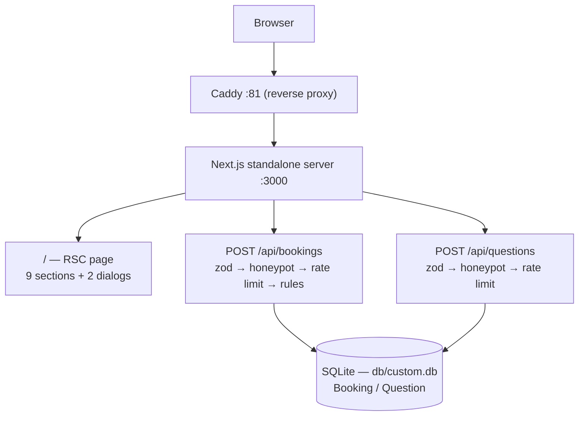

# We Care Car Care — car-care


Marketing and booking site for **We Care Car Care** — an eco-friendly auto detailing and ceramic coating studio in Framingham, MA serving MetroWest Boston since 2010.

## Overview

A single-page site built to convert local search traffic into detail appointments. It presents the service menu (full details, ceramic coating tiers, interior-only) with always-visible sedan + SUV pricing, a drag-to-compare before/after slider, reviews, and FAQs — then funnels visitors into a 4-step booking dialog that validates input, enforces business rules (closed Sundays — timezone-safe, address required for mobile service), and persists the request to SQLite. A lighter "ask a question" dialog captures inquiries that aren't ready to book. The design is a dark, warm-charcoal automotive aesthetic with a two-tone amber + teal accent system, built dark-first rather than themed.

## Key Features

| Feature | Description |
|---|---|
| 📄 Single-page marketing site | 9 composed sections (hero → FAQ → final CTA) on one route, sticky header with mobile sheet nav |
| 🔀 Drag-compare before/after | Pointer-driven slider; the "before" half is the same photo behind a dirty-vision CSS filter |
| 💰 Dual pricing | Every package card shows sedan + SUV prices side by side (no toggle to hunt for); the booking dialog keeps its own vehicle selector |
| 📅 4-step booking dialog | Service (with per-service summaries + Most Popular badge) → date/time → contact → confirm, with server-quoted price and `WCC-XXXXXX` confirmation code |
| 🛡️ API hardening | Zod validation (schemas shared client/server), honeypot bot trap (fake success), sliding-window IP rate limit (5 req / 10 min) — timezone-safe Sunday/window rules |
| 🗄️ Lead persistence | Booking + Question models in SQLite via Prisma; reviewable in Prisma Studio |
| ✨ Motion with respect | IntersectionObserver scroll reveals, CTA shine sweep — all disabled under `prefers-reduced-motion` |
| 📱 Mobile call FAB | Floating call button appears after scrolling past the hero (mobile only) |
| 🧪 Unit tests | Vitest suite (49 tests) covering pricing/date logic, validation schemas, rate limiter, dialog store — run under multiple timezones |
| 🔍 Local SEO | Full metadata, OG/Twitter cards, JSON-LD `AutoWash` schema (address, geo, hours, service areas, rating), `sitemap.xml`, app icon |

## Architecture

| Layer | Technology | Version | Purpose |
|-------|-----------|---------|---------|
| Web framework | Next.js (App Router) | 16.3.5 | Single route + route handlers, standalone output |
| UI runtime | React | 19.3.0 | Server components + client islands |
| Language | TypeScript | 5.9.3 | Strict types across content/data/API |
| Styling | Tailwind CSS | 4.3.3 | CSS-first tokens in `globals.css` |
| UI primitives | shadcn/ui (Radix) | — | Dialog, sheet, accordion, carousel, sonner |
| State | Zustand | 5.0.x | Dialog orchestration store |
| Validation | Zod | 4.6.4 | API request schemas (`src/lib/wcc/schemas.ts`) |
| Tests | Vitest | 5.0.0 | Unit suite over lib logic + schemas + store |
| ORM | Prisma | 6.19.3 | Schema + client |
| Database | SQLite | — | Single-file persistence (`db/custom.db`) |
| Package manager / runtime | bun | 1.3.x | Installs, dev server, prod server |



## File Hierarchy

```
📂 src
 ┣ 📂 app
 ┃ ┣ 📂 api
 ┃ ┃ ┣ 📂 bookings ─ 📄 route.ts — POST booking (zod, honeypot, rate limit, rules)
 ┃ ┃ ┣ 📂 questions ─ 📄 route.ts — POST inquiry
 ┃ ┃ ┣ 📄 route.ts — template hello-world (unused)
 ┃ ┣ 📄 layout.tsx — fonts, metadata, JSON-LD, Toaster
 ┃ ┣ 📄 page.tsx — the single page: section composition
 ┃ ┗ 📄 globals.css — Tailwind 4 tokens, brand utilities (.grain, .shine, [data-reveal])
 ┣ 📂 components
 ┃ ┣ 📂 wcc — 16 site components (hero, packages, booking-dialog, call-fab, …)
 ┃ ┗ 📂 ui — 9 shadcn primitives (accordion, button, carousel, dialog, input, label, sheet, sonner, textarea)
 ┣ 📂 data/wcc — 📄 content.ts — ALL services, prices, areas, FAQs, business facts
 ┗ 📂 lib
    ┣ 📂 wcc — booking.ts (pricing/slots) · booking-store.ts (zustand) · schemas.ts (zod)
    ┣        rate-limit.ts · dates.ts (timezone-safe rules) · __tests__/ (vitest)
    ┣ 📄 db.ts — Prisma singleton (query logging dev-only)
    ┗ 📄 utils.ts — cn()
📂 prisma — 📄 schema.prisma — Booking, Question models
📂 db — runtime SQLite (gitignored; created by db:push)
📂 public — logo.svg, robots.txt, 📂 images (6 generated WebP assets)
📂 scripts — image generation / optimization / visual-check helpers
📂 docs — project prompt, skill docs, SSH git wrapper, audit + remediation plan
```

## Quick Start

Requires **bun ≥ 1.3** (or Node ≥ 24 with npm — but the scripts are written for bun).

```bash
git clone git@github.com:nordeim/car-care.git
cd car-care
bun install

# Database (SQLite file, no services needed)
echo 'DATABASE_URL="file:../db/custom.db"' > .env   # relative to prisma/ → resolves to db/custom.db
bun run db:generate
bun run db:push

bun run dev
```

**Verify setup**

1. Open `http://localhost:3000` — the We Care Car Care landing page renders with the hero image and pricing sections.
2. Click any **Book Now** CTA, walk all 4 steps, submit — you get a `WCC-XXXXXX` confirmation.
3. `bunx prisma studio` → your row is in the `Booking` table.
4. `bun run lint` exits clean; `npm test` passes (49 tests).

### Tests

```bash
npm test            # vitest run — 49 unit tests
npm run test:watch  # watch mode
```

The suite covers pricing/quote logic, day-slot generation, timezone-safe Sunday/window rules, zod schemas, the shared rate limiter, and the dialog store. It is verified green under `TZ=UTC`, `TZ=America/New_York`, and `TZ=Asia/Singapore`.

### Production build

```bash
bun run build    # also copies static + public into .next/standalone/
bun run start    # serves .next/standalone/server.js on :3000
```

## Environment Variables

| Variable | Required | Purpose | Default |
|----------|----------|---------|---------|
| `DATABASE_URL` | Yes | SQLite URL for Prisma (path relative to `prisma/`) | — (`file:../db/custom.db` recommended) |

That is the only variable. There are no auth keys or third-party services.

## API Reference

| Endpoint | Method | Auth | Description |
|----------|--------|------|-------------|
| `/api/bookings` | POST | none | Create a booking request. Zod-validated body: `serviceKey`, `vehicleType`, `serviceMode`, `date` (≤60 days out), `time`, `name`, `phone`, `email`, optional `address`/`city`/`notes`, `addOnCeramic`. Business rules: Sundays rejected, address required for mobile/pickup. Returns `201 {ok, confirmation, priceQuote}` |
| `/api/questions` | POST | none | Create an inquiry: `name`, `email`, optional `phone`, `question` (10–2000 chars). Returns `201 {ok}` |
| `/api/bookings`, `/api/questions` | POST | none | ⚠️ A non-empty `company` field is the honeypot — returns fake `201` and writes nothing. Rate-limited to 5 requests / 10 min per IP (`429` beyond that, with a call-us message) |

## Design System

| Token | Value | Usage |
|-------|-------|-------|
| `--background` | `#0a0b0d` | Page background (warm charcoal) |
| `--foreground` | `#f2f0ea` | Body text (warm off-white) |
| `--primary` | `#f2a61c` | Amber — CTAs, links, key numbers |
| `--accent-teal` | `#5eead4` | Teal — keyword highlights in section headlines (two-tone system; ≈13:1 on background) |
| `--card` | `#121417` | Card surfaces |
| `--muted-foreground` | `#9c9a92` | Secondary text |
| `--destructive` | `#e5484d` | Errors |

**Typography**: Oswald (display — uppercase, tightened; CSS var `--font-oswald`), Archivo (body; `--font-archivo`), both via `next/font`. **Motion**: `[data-reveal]` scroll-in transitions, `.shine` CTA sweep, `.grain` film-grain overlay — each neutralized under `prefers-reduced-motion`.

## Project Status

| Phase | Status | Key Deliverables |
|-------|--------|------------------|
| Site build (page + booking flow + APIs + SEO) | ✅ Done | 16 site components, 2 APIs, Prisma schema, brand system |
| Verification (lint, typecheck, E2E booking, API contract, mobile 375px) | ✅ Done | Booking E2E persisted + cleaned; honeypot returns fake success |
| Audit + remediation (visual parity, security, tests) | ✅ Done | See `docs/audit-and-remediation-2026-09.md` — Next 16.3.5, dep pruning, dual pricing, teal accent system, toast fix, FAB |
| Automated test suite | ✅ Done | Vitest — 49 unit tests over lib/schemas/store |
| Admin surface for leads | ❌ Not started | Owner reviews leads via Prisma Studio |

## Troubleshooting

| Issue | Cause / Fix |
|-------|------------|
| `bun run start` serves missing styles/images | The `build` script must copy `static`/`public` into `.next/standalone/` — run `bun run build` (not `next build` alone) |
| Type errors don't fail the build | Fixed — `ignoreBuildErrors` is now `false`; `bunx tsc --noEmit` and `bun run build` both enforce types |
| 429 while testing the booking API | In-memory rate limit (5 req / 10 min per IP) — restart the dev server to reset |
| `@prisma/client did not initialize` | Run `bun run db:generate` after cloning or editing the schema |
| Sunday date rejected | Intentional: the shop is closed Sundays (both UI and API enforce it) |

## Contributing

- Keep all business facts in `src/data/wcc/content.ts` — components and API both derive from it.
- Before every commit: `npm test` && `bun run lint` && `bunx tsc --noEmit` && `bun run build`.
- Keep `db/` untracked (PII). `bun run db:push` recreates `db/custom.db` locally after cloning.
- Conventional Commits on `main`; keep commits atomic.
- Deep engineering reference: **`car-care_SKILL.md`** (repo root) — design system, patterns, anti-patterns, debugging guide, and pre-ship checklist distilled from the build + audit history.

## License

Proprietary — built for We Care Car Care. All rights reserved; no open-source license granted. (Reference material in `docs/` keeps its own provenance.)
